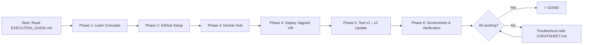

# P3 Documentation & Implementation Guide - START HERE

## Welcome to Inception-of-Things Part 3 (IOT P3)!

This folder contains everything you need to set up a **Kubernetes + ArgoCD + GitOps** deployment pipeline. Below is the roadmap for getting started.

---

## 📚 Documentation Files (Read in Order)

### 1. **README.md** ⭐ START HERE
- Overview of the project
- Quick start instructions
- High-level architecture

### 2. **SETUP_GUIDE.md** - Conceptual Overview & Commands
- Learn the 3 concepts: K3d vs K3s vs K3c
- Understand ArgoCD and GitOps
- Understand Docker Hub's role
- Step-by-step installation commands

### 3. **EXECUTION_GUIDE.md** - Practical Step-by-Step Tasks
- Detailed checklist with actual commands you need to run
- Phase-based approach (Learning → GitHub → Docker Hub → Deploy → Test)
- Organized by 6 phases with specific tasks
- **Most important for actually implementing**

### 4. **CHEATSHEET.md** - Quick Reference
- Common commands you'll use repeatedly
- Docker, Kubernetes, ArgoCD commands
- Troubleshooting quick fixes
- Keep open while working

### 5. **GITHUB_SETUP.md** - GitHub Container Registry (Advanced)
- Alternative approach using GitHub Container Registry (GHCR)
- GitHub Actions for automatic builds
- Use this if you want CI/CD pipeline with GitHub Actions

### 6. **WEBAPP_SETUP.md** - Building Your Container
- How to build and test the Flask app locally
- Docker build and push commands to Docker Hub
- Already covered in EXECUTION_GUIDE but more detailed here

---

## 🚀 Quick Start (3 Steps)

### Step 1: Read & Learn (30-45 minutes)
1. Read this document
2. Read SETUP_GUIDE.md (concepts section)
3. Watch the Rancher video (see link below)

### Step 2: Follow the Checklist (2-2.5 hours)
1. Open EXECUTION_GUIDE.md
2. Follow each phase sequentially:
   - Phase 1: Learning ✓
   - Phase 2: GitHub Repositories
   - Phase 3: Docker Hub
   - Phase 4: Deploy Everything
   - Phase 5: Test GitOps Workflow
   - Phase 6: Verification Screenshots

### Step 3: Use Cheatsheet & Reference
- Keep CHEATSHEET.md open for common commands
- Refer to SETUP_GUIDE.md for more details on specific topics

---

## 📁 Project Structure

```
p3/
├── README.md                          # Project overview
├── SETUP_GUIDE.md                     # Conceptual guide + commands
├── EXECUTION_GUIDE.md                 # 👈 PRACTICAL CHECKLIST (follow this!)
├── CHEATSHEET.md                      # Quick reference
├── GITHUB_SETUP.md                    # GitHub Actions + GHCR (optional)
├── WEBAPP_SETUP.md                    # Local webapp building
│
├── Vagrantfile                        # VM configuration (ready to use)
├── ips.conf                           # Network configuration
│
├── scripts/
│   ├── install_tools.sh               # Install Docker, k3d, ArgoCD CLI
│   ├── setup_k3d_cluster.sh           # Create k3d cluster
│   ├── setup_argocd.sh                # Install ArgoCD
│   ├── deploy_app.sh                  # Deploy application
│   └── build_versions.sh              # Helper to build v1/v2 images
│
├── webapp/                            # Flask application (ready to use)
│   ├── app.py                         # Flask app with versioning
│   ├── Dockerfile                     # Container definition
│   ├── requirements.txt               # Python dependencies
│   ├── docker-compose.yml             # Local testing
│   └── README.md
│
└── confs/                             # Kubernetes manifests
    ├── deployment.yaml                # App deployment definition
    ├── service.yaml                   # Service configuration
    ├── ingress.yaml                   # Ingress (optional)
    └── argocd-app.yaml                # ArgoCD application manifest
```

---

## 🎯 What You'll Build

By the end of this project, you'll have:

1. **Docker Hub Repository**
   - Public repo with your Docker username
   - Tagged images: v1, v2, latest
   - Accessible at: `https://hub.docker.com/r/YOUR-USERNAME/iot-app`

2. **GitHub Repository (Manifests)**
   - Public repository with Kubernetes manifests
   - Contains: deployment.yaml, service.yaml, ingress.yaml
   - Named: `YOUR-USERNAME-iot-manifests`
   - Tracked by ArgoCD for GitOps

3. **Kubernetes Cluster (k3d)**
   - Running in Docker (isolated from your host)
   - 1 server + 2 agents
   - 2 namespaces: `argocd`, `dev`

4. **ArgoCD Installation**
   - Running in `argocd` namespace
   - Watches your GitHub manifests repo
   - Auto-deploys on changes (GitOps)

5. **ApplicationDeployment**
   - Running in `dev` namespace
   - Updates automatically via ArgoCD
   - Test version changes: v1 → v2

---

## 🔑 Key Concepts

### K3d vs K3s vs K3c
- **K3s**: Lightweight Kubernetes (~40MB binary)
- **K3d**: K3s running as Docker containers
- **K3c**: Alternative containerization (less common)
- **For this project**: Use K3d (easiest for local development)

### GitOps
- Single source of truth = GitHub repository
- Push changes to GitHub → ArgoCD auto-deploys
- No manual `kubectl apply` needed

### Docker Hub
- Image registry (like npm for npm packages)
- Store your app with version tags (v1, v2)
- ArgoCD pulls images from here

### ArgoCD
- Watches your GitHub manifest repo
- Automatically deploys changes
- Shows sync status in web dashboard
- Declarative: define desired state in YAML

---

## 📋 Pre-Requisites

You need to have:
- [ ] Docker installed on your machine
- [ ] Vagrant installed
- [ ] VirtualBox installed
- [ ] Git installed
- [ ] Docker Hub account (create at https://hub.docker.com)
- [ ] GitHub account

---

## 📖 Learning Resources

### Videos
- **Rancher Meetup - K3s/K3c/K3d Overview**: https://www.youtube.com/watch?v=hMr3prm9gDM&ab_channel=Rancher

### Documentation
- **ArgoCD Getting Started**: https://argo-cd.readthedocs.io/en/stable/understand_the_basics/
- **ArgoCD Core Concepts**: https://argo-cd.readthedocs.io/en/stable/core_concepts/
- **K3d GitHub**: https://github.com/k3d-io/k3d
- **Kubernetes Namespaces**: https://kubernetes.io/docs/concepts/overview/working-with-objects/namespaces/
- **GitOps Info**: https://www.gitops.tech/

### Articles
- **K3d Getting Started with ArgoCD**: https://dev.to/danielcristho/k3d-getting-started-with-argocd-5c6l

---

## ⚡ Quick Issues & Fixes

### Terminal stuck / Not responding
**Solution**: Press `Ctrl+C` to cancel current operation

### VM takes too long to start with `vagrant up`
**Solution**: This is normal for first run (30-60 min). Vagrant will:
- Download Ubuntu image
- Install Docker, k3d, ArgoCD
- Create k3d cluster
- Deploy ArgoCD
All happens automatically via provisioning scripts

### Can't push to Docker Hub
**Issue**: Not logged in  
**Solution**: `docker login` and enter credentials

### `localhost:8888` not accessible
**Issue**: Port forwarding not set up  
**Solution**: Check Vagrantfile has port 8888 forwarded

### ArgoCD not syncing to latest GitHub changes
**Solution**: 
```bash
argocd app get iot-app --refresh
argocd app sync iot-app
```

---

## 🏁 Implementation Roadmap



---

## 🎓 Learning Path

**If you want to understand deeply:**
1. SETUP_GUIDE.md - Concepts section
2. Watch Rancher video (30 min)
3. Read ArgoCD docs basics
4. Then follow EXECUTION_GUIDE.md

**If you want to get it working fast:**
1. Quick skim of this document
2. Jump straight to EXECUTION_GUIDE.md Phase 2
3. Follow phases sequentially
4. Reference CHEATSHEET.md as needed

---

## ✅ Success Checklist

By end of project, you should have:

- [ ] K3d cluster running with 1 server + 2 agents
- [ ] ArgoCD installed in `argocd` namespace
- [ ] Application deployed in `dev` namespace
- [ ] Your app images (v1, v2) on Docker Hub
- [ ] Public GitHub manifests repository
- [ ] ArgoCD syncing with GitHub repo
- [ ] Tested: Push GitHub change → App auto-updates
- [ ] Screenshots showing namespaces, pods, ArgoCD dashboard

---

## 🆘 Getting Help

1. **Check CHEATSHEET.md** - Most common issues covered
2. **Check EXECUTION_GUIDE.md** - Troubleshooting section
3. **Read the error messages** - They usually tell you what's wrong
4. **Use kubectl describe** - Shows detailed error info
5. **Check pod logs** - `kubectl logs POD-NAME -n dev`

---

## 🚀 Ready to Start?

**👉 Open [EXECUTION_GUIDE.md](EXECUTION_GUIDE.md) and begin with Phase 1!**

After learning the concepts, come back to Phase 2 and work through each phase sequentially. Keep CHEATSHEET.md open for quick reference.

Good luck! 🎉
